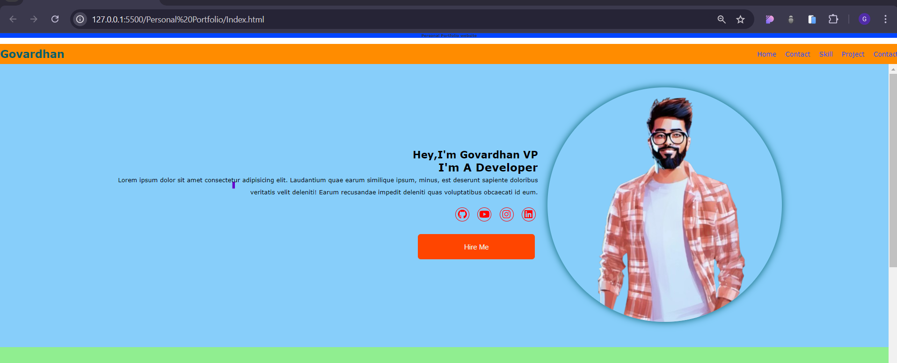

<!-- fontawesome link -->

<!-- bars icon -->

<i class="fa-solid fa-bars"></i>

<!-- cancel icon -->

<i class="fa-solid fa-times"></i>

<!-- Github icon -->

<i class="fa-brands fa-github"></i>

<!-- Youtube icon -->

<i class="fa-brands fa-youtube"></i>

<!-- instagram icon -->

<i class="fa-brands fa-instagram"></i>

<!-- linked in icon -->

<i class="fa-brands fa-linkedin"></i>

